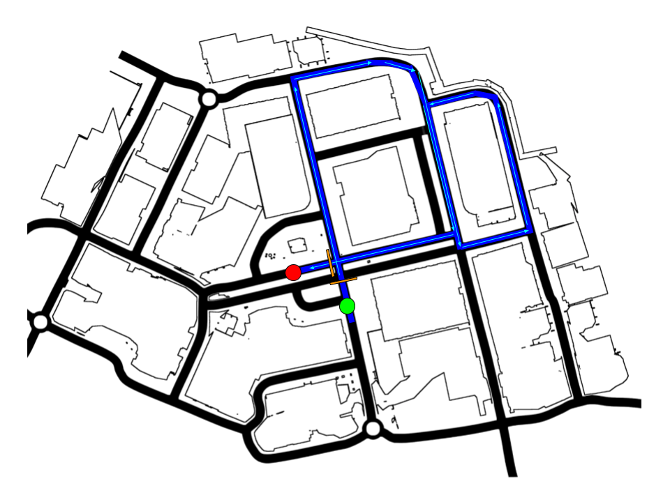
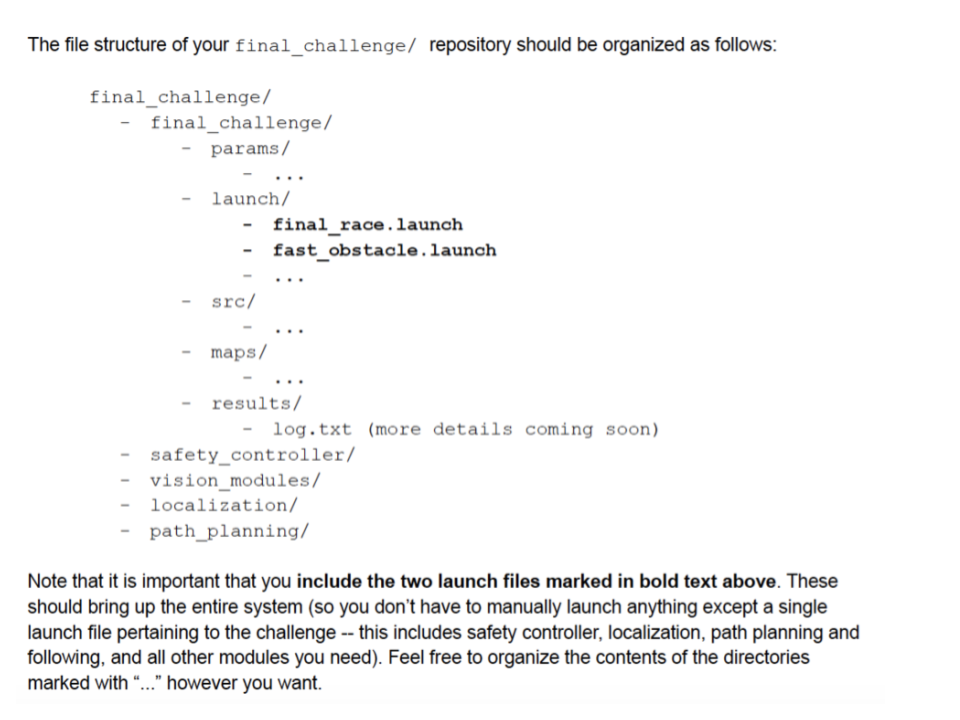
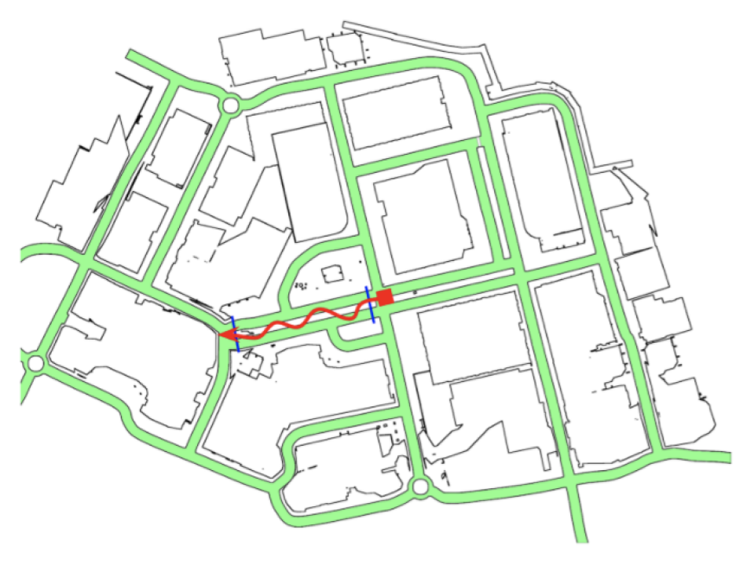
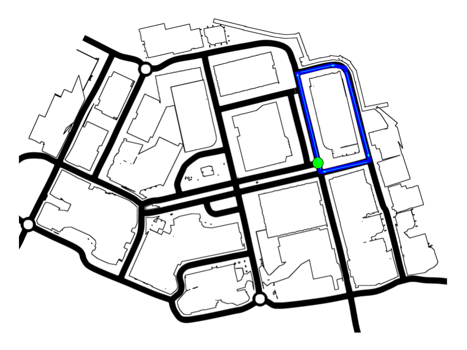

| Deliverable | Due Date              |
|---------------|----------------------------------------------------------------------------|
| Race/Challenge Day | Friday, May 14th at 2:00PM EDT |
| Code Pushed to Github  | Friday, May 14th at 11:59PM EDT |
| Briefing (15 minutes presentation, 5 minutes Q&A) - [rubric](https://docs.google.com/document/d/1NmqQP7n1omI9bIshF1Y-MP70gfDkgEeoMjpWv8hjfsY/edit?usp=sharing)  | Wednesday, May 19th at 1:00PM EDT |
| Report - [rubric](https://docs.google.com/document/d/1B6l7vKJFN3CPPcMn8cKKArHUU_Bq_YUZ5KxKoP6qMk0/edit?usp=sharing) | Wednesday, May 19th at 11:59PM EDT |
| [Team Assessment](https://forms.gle/Yp4d7eEJxk9rZpWd9)  | Wednesday, May 19th at 11:59PM EDT |

**Note:** we will offer a mock race session on Wednesday, May 12th during lab hours to test your final challenge implementation on the TA machines that will be running your code in the official final challenge

# Final Challenge 2021 (TESSE)

## Introduction

Congratulations on completing the six labs of RSS!

This semester, you've learned how to implement real-time robotics software on a widely-used software framework (ROS).
You know how to read sensor data (Lidar, Camera, Odometry) and convert it into a useful representation of the world (homography, localization).
You've written algorithms which make plans over the world's state (parking, line following, path planning) and couple with controllers (PD control, pure pursuit) to accomplish tasks.

Now, your team will synthesize all that you've learned to design a competitive entry for the *2021 RSS Final Challenge*!

## Submission and Grading

This section describes the grading scheme for the final race and challenge.

The deliverables for this lab consist of the race around Windridge City (the city in TESSE) and a choice between two final challenges.
Both the race and challenge are graded on a 10 point scale with specific information on how these points are calculated detailed in the scoring sections below.
There will also be a report and briefing for this lab, and each teammate must submit the team member assessment form.
See the deliverables table at the top of this handout for all deadlines.

The grade breakdown is shown below:

| Deliverable Grade | Weighting              |
|---------------|----------------------------------------------------------------------------|
| briefing grade (out of 10)  | 10% |
| report grade (out of 10) | 30% |
| part A: final race grade (out of 10) | 25% |
| part B: final challenge grade (out of 10) | 35% |

## Overview of the 2021 RSS Virtual Final Challenge

Historically, the RSS Final Challenge contains two parts: a race around Stata basement and an obstacle course to be completed as quickly as possible.
In our new virtual environment, these challenges have remained relatively intact with some optional opportunities for extension for the brave.

This year, we continue to have two major deliverables:
* A **race for time** around the Windridge City map that we've been testing our virtual car in this semester.
* A choice between two final challenges:
    * A safe to implement and fully VDI capable **fast obstacle avoidance** challenge
    * A more risky **imitation learning** challenge using only camera input to complete the simple wall follower track from lab 3.

We will offer instructions on how to fork your prior work on labs 3-6 into a new final challenge workspace, so that your older lab code will remain unchanged.

As race day approaches, we will offer informal times to test your final challenge implementation.
This includes Wednesday, May 12th where we will hold some mock race day trials.

More specific detail on each race/challenge is available in the README below and associated help docs. We wish you luck!!

## Important Links

| Resource | Link |
|---------------|----------------------------------------------------------------------------|
| VDI Instructions                                      | https://docs.google.com/document/d/143tArZ9sikEZxyEtC89RUYEHRyFq-N4Q35LPgGTILlg/edit?usp=sharing|
| TESSE install instructions                            | https://github.com/mit-rss/tesse_install|
| executable drive folder                               | https://drive.google.com/drive/u/0/folders/15BGjddbtvlifvTnLO5aHRbJZsQxe2DFP|
| [imitation learning] tesse-ros-bridge                 | https://github.mit.edu/rss/tesse-ros-bridge/tree/imitation_learning|
| [imitation learning] tesse-interface                  | https://github.mit.edu/rss/tesse-interface/tree/imitation_learning|
| imitation learning instructions                              | https://github.com/mit-rss/imitation_learning_tesse|
| final challenge setup instructions                               | https://github.mit.edu/rss/final_challenge|
| team member assessment form                           | https://forms.gle/Yp4d7eEJxk9rZpWd9 |

## Final Race

### Task

Your task is to complete a lap around Windridge City (the city in the TESSE simulator) as quickly as possible while sustaining as few collisions as possible.
You will use:
* Ground truth localization from TESSE (OPTIONAL: your particle filter localization from Lab 5 for bonus points, see details below)
* Pure pursuit path following to follow a pre-defined path that you tune
* To track collisions, use the topic `/tesse/collision`, which will tell you when the car is in collision with an object in the scene. This is particularly helpful when using VDIs where you don't have graphics. 

Feel free to tune existing modules, modify trajectory points, or even add new code to complete the course as fast as you can.

### Environment

The final race will follow this course trajectory:

In the image, there is a green starting point, blue arrows to indicate which roads to follow, and a red terminal point.
Each arrow in the trajectory should be followed only once.
The TAs will start and stop the clock exactly when the car crosses the orange lines along the trajectory.
It is encouraged to accelerate across the finish line!

The car will have Lidar and IMU sensor data available to make control decisions.
Further, each team will have the choice to subscribe to either the ground truth odometry or run their particle filter to complete the course for bonus points on the final score.

You can find the executable to download and run [here](https://drive.google.com/drive/u/2/folders/15BGjddbtvlifvTnLO5aHRbJZsQxe2DFP).

### Scoring

Your score is proportional to your best lap time.
For the final race, your score can be calculated based on the formula below:

**final score = 145 - time_to_complete [sec] - 10 * number_of_collisions**

Notes about final scores:
* Scores below a 70 will result in a failure.
* Scores above a 100 are absolutely allowed!
* Completing the final race using particle filter estimated pose will receive +5 bonus points
* The team with the fastest implementation will receive +10 bonus points for their success!
* The grading formula is based on a lap time of 45 seconds being a score of 100 and a time of 75 seconds being a score of 70.

**Final Scores to Deliverable Points Conversion**

The points (out of 10 as specified by the deliverable table) you will receive on this deliverable scale with the final score:

**deliverable points = final score / 10**

### Setup Instructions

**NOTE:** It is imperative that you **include specific launch files**: `final_race.launch` and `fast_obstacle.launch` or else the TAs will be unable to run your code on race day.

The file and directory hierarchy can be seen here:

Instructions on how to initialize your final challenge workspace and integrating built modules can be found here: [https://github.mit.edu/rss/final_challenge](https://github.mit.edu/rss/final_challenge)

## Final Challenge Option 1: Obstacle Avoidance in TESSE

### Task

The goal of the Obstacle Avoidance challenge is to traverse an obstructed road as fast as possible.
The simulator will randomly spawn a number of static obstacles on the road.
Your car will need to detect and avoid these obstacles in real-time using the Lidar sensor.
The goal is to complete the Fast Obstacle Avoidance course as fast as possible with little to no collisions.

The obstacles will have the following properties:
* All obstacles will be stationary
* No dead ends
* No obstacles will be within 1m of start or goal
* No obstacle will obscure more than 50% of the road’s width

### Environment

The course for the fast obstacle avoidance challenge will just be a straight shot down the 4-lane highway to the left of the spawn point,
and up to the next 3-way intersection.
On Race Day, we will take a subset of the available obstacles and make that the course for everyone.
You won't know what that subset is ahead of time, so test with different numbers of obstacles.
There is a maximum of 19 obstacles at this time.

To track collisions, use the topic `/tesse/collision`, which will tell you when the car is in collision with an object in the scene. This is particularly helpful when using VDIs where you don't have graphics.

A video of the Fast Obstacle Avoidance course can be seen [here](https://drive.google.com/open?id=1c-Pp6vZvzlnFsEls-HOOBYOYfozxoqsV).

You can find the executable to download and run [here](https://drive.google.com/drive/u/2/folders/15BGjddbtvlifvTnLO5aHRbJZsQxe2DFP).

**Note:** To change the number of spawned obstacles on the 4 lane highway for testing purposes, modify the `num_objects: <insert desired number of obstacles here>` param at `tesse-ros-bridge/ROS/params/object_spawn_params.yaml.` Note that this number will be set on race day and your changes overwritten.

### Scoring

We will offer each team 3 opportunities to complete the Fast Obstacle Avoidance challenge.

|Objectives (out of 10 points) | Score Earned |
|------------------------------|--------------|
| Navigate a few obstacles | 1.5 points |
| Navigate the entire course without major collisions  | 3 points |
| Navigate the entire course with no collisions | 1.5 points |
| Complete the course at >8 meters/sec | 2.5 points |
| Complete the course at >10 meters/sec | 1 points |
| Complete the course at >12 meters/sec | .5 points |

### Setup Instructions

You can develop modules to complete Fast Obstacle Avoidance in the same repository as the final race.
So, complete the [final race setup instructions](https://github.mit.edu/rss/final_challenge) to be ready to develop this module.

## Final Challenge Option 2: Imitation Learning in TESSE

**Disclaimer: choose this option at your own risk. The current staff solution (you can see a video example below) does not consistently complete the track in a way that would earn full points for this challenge, so in order to earn a good score, you would need to improve your performance beyond the staff solution. We believe this could be feasible as we have provided tips and suggestions for augmentation and tuning that can be applied on top of the staff solution, but it is only recommended if you have prior experience with deep learning. Also, only choose this option if your laptop can run TESSE at good speeds (the camera topic is not VDI compatible).**

### Task

This challenge provides an introduction to end-to-end imitation learning for vision-only navigation of the racecar around a known course.
Let's break that down:

* We will train a deep learning model - specifically, a convolutional neural network (CNN) -
to **regress a steering angle** directly **from an image** taken from the front bumper similar to visual servoing.
* Here, **"imitation learning"** refers to a branch of supervised machine learning which focuses on imitating behavior from human-provided examples.
In our case, we will drive a car around a track several times to provide examples for the CNN to mimic.
This learning objective is also frequently termed behavioral cloning.
* **"Vision-only"** refers to using an RGB camera as the only input to the machine learning algorithm.
* LIDAR, depth, or vehicle IMU data are not used.
* **"End-to-end learning"** is shorthand for the CNN's ability to regress a steering angle
(i.e., an actuation for the Ackermann steering controller) from unprocessed input data (pixels).
We will not need to pre-process input features ourselves, such as extracting corners, walls, floors, or optical flow data.
The CNN will learn which features are important, and perform all the steps from image processing to control estimation itself ("end-to-end", loosely speaking).

### Environment

We will train the model using camera data and steering angles collected from the TESSE simulator in order to autonomously drive around the the simple wall follower track from lab 3:

However, now the car will only have access to an RGB camera input (in the spirit of making control decisions only based on vision). To track collisions, use the topic `/tesse/collision`, which will tell you when the car is in collision with an object in the scene.

A video of the staff solution can be seen [here](https://drive.google.com/file/d/1arevLYAmHEvb0Lq7hYFqEh8ezOh532p9/view?usp=sharing). As you can see (and mentioned above), the staff solution sometimes cuts corners, scrapes against the wall, or misses turns.

You can find the executable to download and run [here](https://drive.google.com/drive/u/2/folders/15BGjddbtvlifvTnLO5aHRbJZsQxe2DFP).

### Scoring

We will offer each team 2 opportunities to complete a two-lap run of the track.

A major collision below is one where you have to manually step in and drive the car back onto the track so that it can keep going - successfully completing the course with 1 major collision means that the car was able to successfully complete the remainder of the course after being manually driven back onto the road following the collision.

|Objectives (out of 10 points) | Score Earned |
|------------------------------|--------------|
| Successfully complete the course with at most 1 major collision (some wall scraping allowed) | 5 points |
| Successfully complete the course with 0 collisions or wall scraping of any kind | 3 points |
| Successfully complete two laps around the course with  0 collisions or wall scraping of any kind | 2 points |
| Optional: successfully complete the course with 0 collisions or wall scraping at a speed higher than 3 m/s, or at variable rather than constant speeds | 2 bonus points |

### Setup Instructions

Instructions for completing the imitation learning exercise can be found [here](https://github.com/mit-rss/imitation_learning_tesse).

## Final Notes and Tips

### Spawn Points
Toggle between different spawn points by setting the `enabled` parameter to `True` in the file `tesse-ros-bridge/ROS/params/tesse_agent_params.yaml` for the spawn points specified here:
- final_race_pose: The final race spawn point a short distance before the start line.
- obstacle_avoidance_pose: The obstacle avoidance challenge spawn point a short distance before the start line.
- wall_follower_simple: The imitation learning spawn point

Don't try to change these spawn point poses, they will be overwritten on race day.
